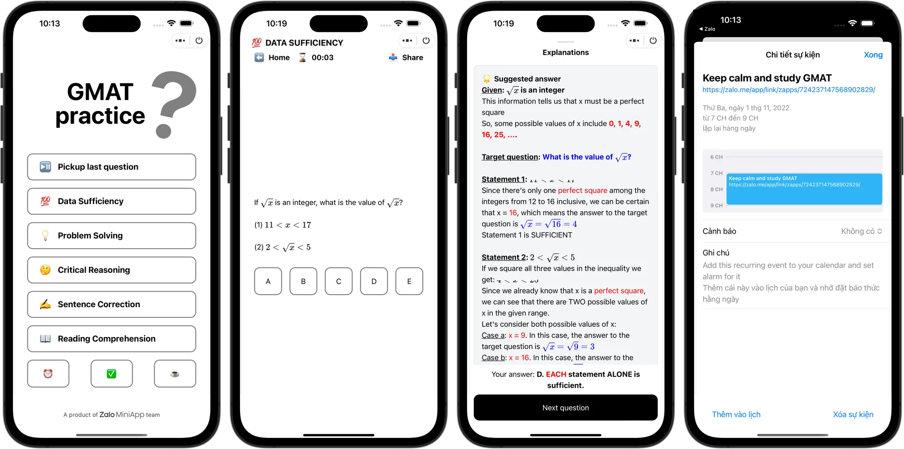

# Mini GMAT

Mini GMAT is a Zalo Mini App client for the [GMAT Database](https://github.com/mister-teddy/gmat-database) project. It is designed to provide users with a wide range of GMAT practice questions to help them prepare for the GMAT exam.

## Preview

| Demo                      | Entry point                    |
| ------------------------- | ------------------------------ |
|  |  |

## Features

### View Questions

Users can access a vast collection of GMAT practice questions on this app by navigating through various categories and sub-categories. Each question is presented in a clear and easy-to-read format, making it easy for users to understand the question and attempt it.

### Different Question Types

Mini GMAT supports five different types of questions: Quantitative Comparison, Data Sufficiency, Problem Solving, Sentence Correction, and Critical Reasoning. Users can select the question type they want to practice and filter the questions based on their difficulty level.

### Explanations

For each question, the app provides a detailed explanation of the solution, helping users understand the concepts involved and learn from their mistakes. The explanations are provided in an easy-to-understand language and include step-by-step solutions.

### Add to Calendar

Users can set up recurring reminders on Mini GMAT to study for the GMAT exam every day, which will be added to their native calendar app. The reminders will help users stay on track with their study goals and are customizable in terms of frequency and time. This feature is especially useful for users with busy schedules who need regular reminders to stay focused on their GMAT preparation.

### Quiz & Leaderboard

Mini GMAT offers customizable quizzes created by the admin, with users able to take the quiz as many times as they want, whenever they want. After submitting their answers, users can view their scores and the top candidates on a podium. This feature encourages healthy competition and motivates users to improve their scores over time, making it a useful tool for users to assess their understanding of GMAT concepts and track their progress.

## License

This project is licensed under the MIT License.
